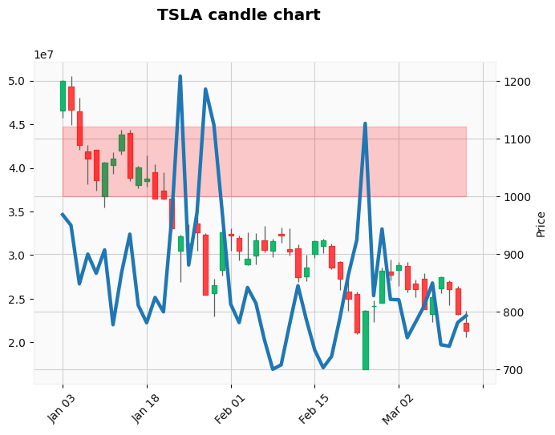

# Plot candle chart for Tesla

- Get the data from yahoo finance

- Store the data as cache

- Retrieve the data and use it to plot and draw the candle chart


```python
import yfinance as yf

stock = "TSLA"

df = yf.download(stock, interval="1d", start="2022-01-01")
```

    [*********************100%***********************]  1 of 1 completed


```python
import mplfinance as mpl

mpl.plot(
    df,
    title=f"{stock.upper()} candle chart",
    style="yahoo",
    type="candle", 
    mav=15, 
    volume=True,
    fill_between={
        "y1": 1000,
        "y2": 1120,
        "alpha": 0.2,
        "color": "red",
    }
)
```


    

    


```python
import mplfinance as mpl

indicators = mpl.make_addplot(df.Volume)

mpl.plot(
    df,
    title=f"{stock.upper()} candle chart",
    style="yahoo",
    type="candle", 
    fill_between={
        "y1": 1000,
        "y2": 1120,
        "alpha": 0.2,
        "color": "red",
    },
    addplot=indicators,
)

# More docs - 
# https://github.com/matplotlib/mplfinance/blob/master/examples/addplot.ipynb
```


    

    

